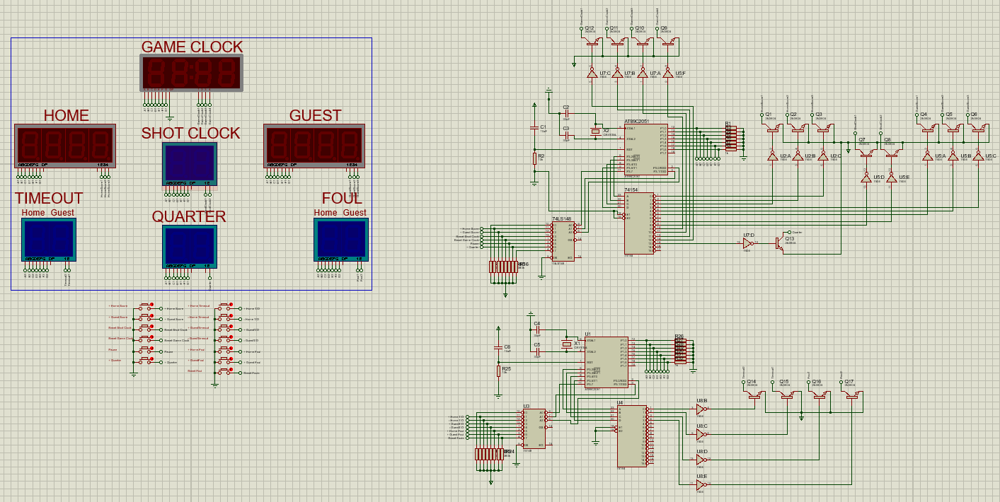
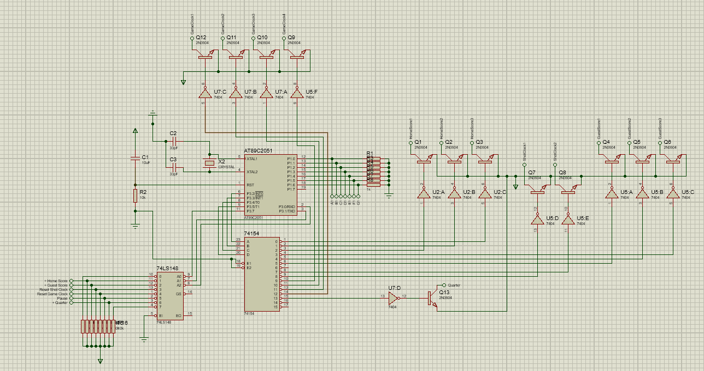
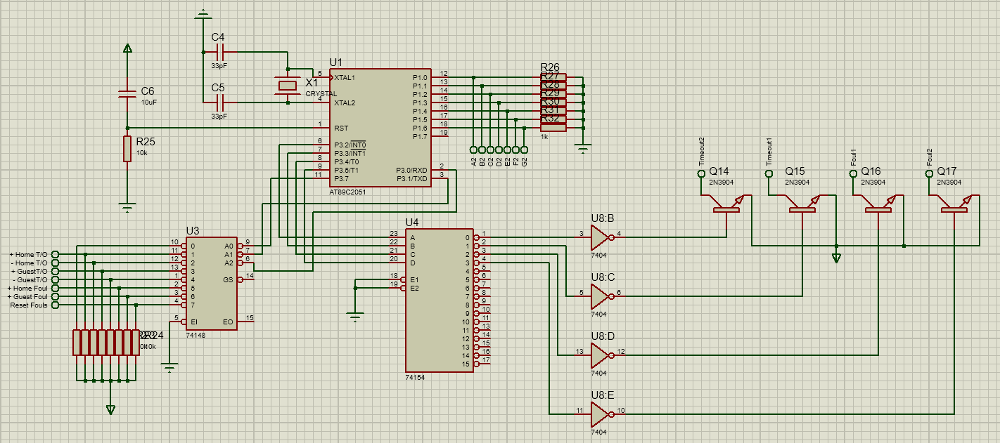
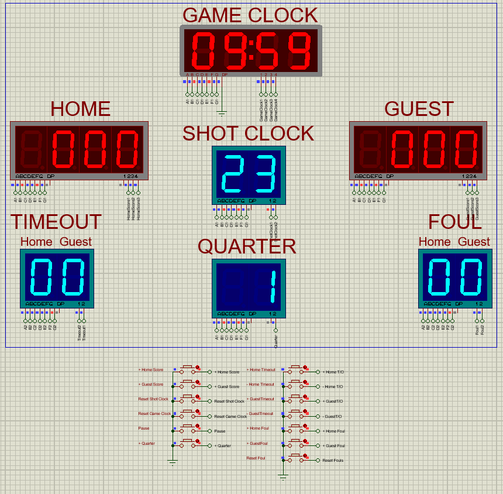
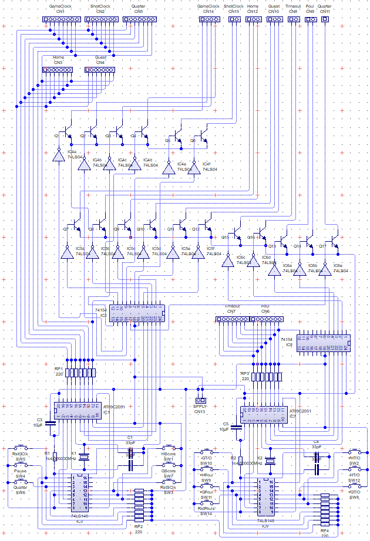
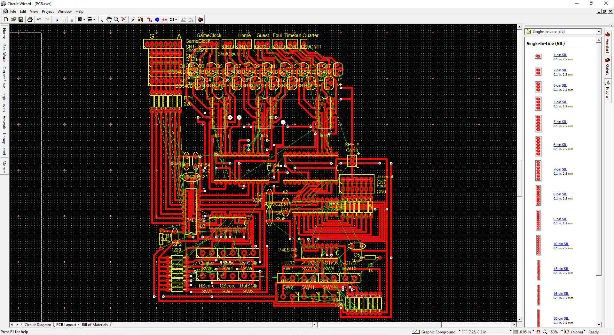
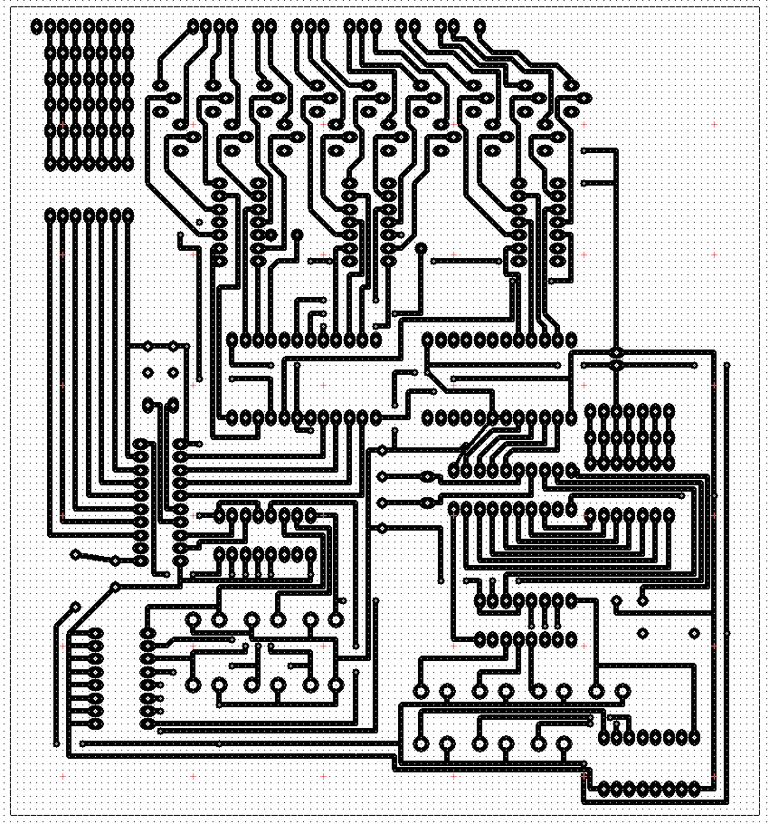
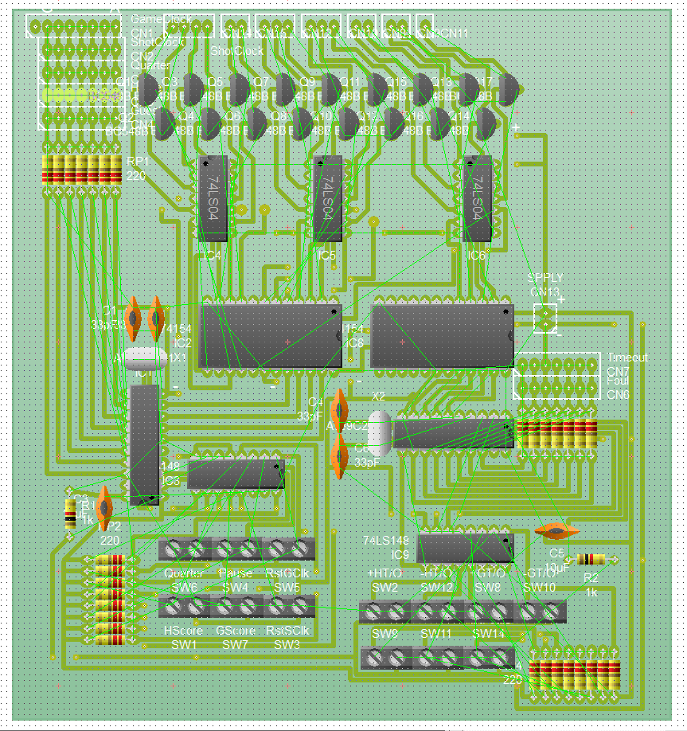

<h1 align="center">Basketball Scoreboard</h1>

The second of the two OJT Projects I was able to finish. It is a working basketball scoreboard and is ready for deployment as soon as the development is finished. It uses two (2) AT89C2051, two (2) 74LS148 Encoder for input buttons, and two (2) 74LS154 Decoder connected to the multiple Anode 7-Segment Display (Multiplexed).

## 🛠️ Project Components

<ul>
   <li>2x AT89C2051 - Main brain of the project. Due to it's small amount of pins, two of them are needed to cater all operations.</li>
   <li>2x 74LS148 Encoder - Mainly used for 13 push buttons input (multiplexed). These buttons are: 
   </li>
   <li>2x 74LS154 Decoder - It is connected to the multiple Anode 7-Segment Display which takes up 17 Pins.</li>
   <li>Anode 7-Segment Display</li>
      <ul>
         <li>Four Digit</li>
            <ul>
               <li>Game Clock</li>
               <li>Home and Guest Scores</li>
            </ul>
         <li>Two Digit</li>
            <ul>
               <li>Shot Clock</li>
               <li>Timeout (Both Teams)</li>
               <li>Fouls (Both Teams)</li>
               <li>Quarter</li>
            </ul>
      </ul>
   <li>13x Push buttons to handle all its operations.</li>
      <ul>
         <li>Adding of Home and Guest Score (2x)</li>
         <li>Resetting of Shot and Game Clocks (2x)</li>
         <li>Adding of Home and Guest Timeout (2x)</li>
         <li>Subtracting of Home and Guest Timeout (2x)</li>
         <li>Adding of Home and Guest Fouls (2x)</li>
         <li>Resetting of Fouls (1x)</li>
         <li>Pause (1x)</li>
         <li>Adding Quarters (1x)</li>
      </ul>
   <li>Transistors, Capacitors & Resistors (values are available in the images below)</li>
   <li>Enough Supply to Power the whole project.</li>
</ul>

## ❓ How to use

1.  Download and install [Raisonance IDE](https://www.raisonance.com/ride7.html) (Preferred) or [Keil µVision IDE](https://www2.keil.com/mdk5/uvision/) for coding and converting of Embedded C/ Assembly codes to .HEX files.

2.  Download and Install [Proteus 8](https://www.labcenter.com/downloads/) or later versions.

3.  Download and install [Circuit Wizard](https://en.freedownloadmanager.org/Windows-PC/Circuit-Wizard.html).

4.  Open Proteus and create the schematic of the project based on the image below.

    

    The schematic below is for the first AT89C2051 where it handles:
      <ul>
         <li>Adding of Home and Guest Score (2x)</li>
         <li>Resetting of Shot and Game Clocks (2x)</li>
         <li>Pause (1x)</li>
         <li>Adding Quarters (1x)</li>
      </ul>

    

    The schematic below is for the first AT89C2051 where it handles:
      <ul>
         <li>Adding of Home and Guest Timeout (2x)</li>
         <li>Subtracting of Home and Guest Timeout (2x)</li>
         <li>Adding of Home and Guest Fouls (2x)</li>
         <li>Resetting of Fouls (1x)</li>
      </ul>

    

5.  Open RIDE/ Keil IDE and code the script needed (either Embedded C or Assembly) by referencing the C code inside the Code Directory. Convert it then to .HEX File.

6.  Go back to Proteus and import the created .HEX file to the Microcontroller and run it. It should work like this:

7. Open Circuit Wizard to begin the fabrication of the PCB. Create the schematic of it based on the image below.

   

8. Proceed to routing and configure them to your liking or follow the image below.

9. Real Life View

