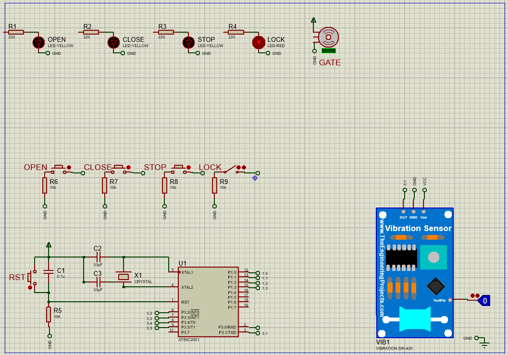
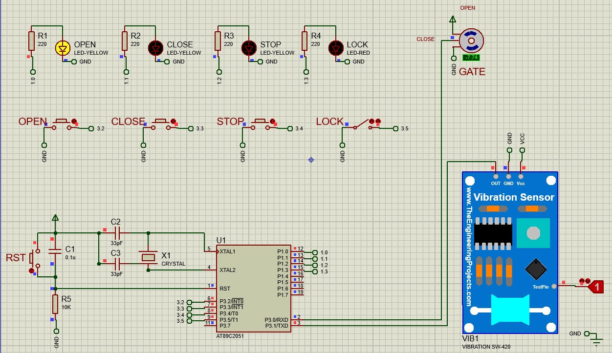
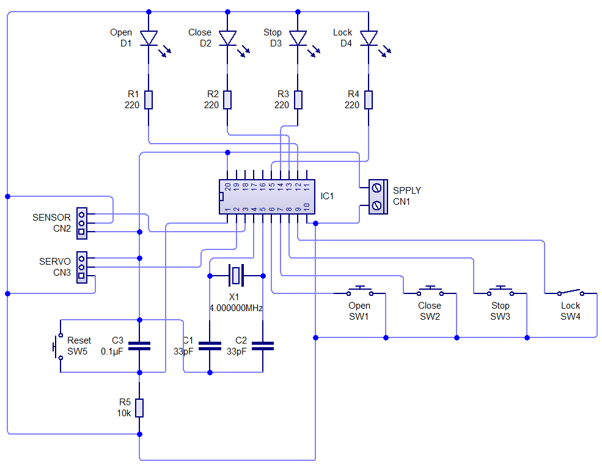
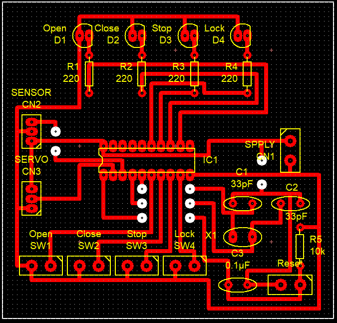
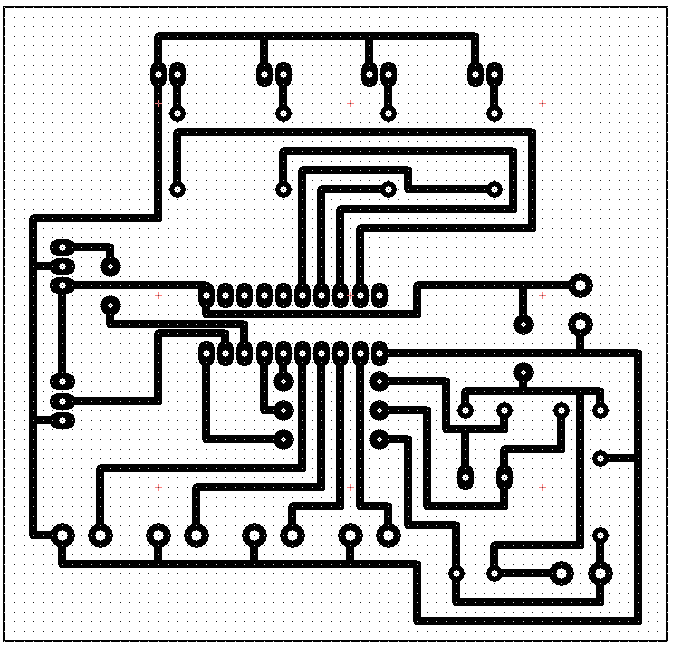
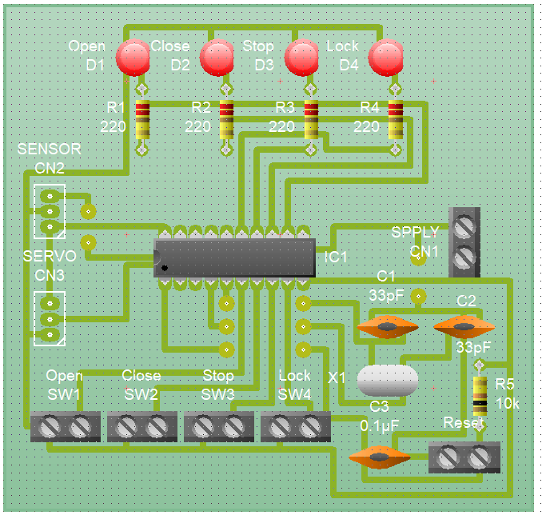

<h1 align="center">Button and Vibration Sensor Operated Gate System</h1>

The first of the two OJT Projects I was able to finish. It is a gate system that can be opened, lock, close, and or stop whatever process it is currently undergoing using four (4) push buttons, a vibration sensor and an AT89C2051. THe actuator on this project is a servo motor but can be easily changed to any real-life/project actuators.

## 🛠️ Project Components

<ul>
   <li>AT89C2051 - Main brain of the project.</li>
   <li>Any Sensors - Vibration Sensor is preferred as it can be an indicator that an object, person, and or car is nearing the gate and is a signal to open it.
   </li>
   <li>Any actuators - A motor, servo or any gate controlling actuators.</li>
   <li>Push buttons for the four (4) operations.</li>
   <li>LED's for operation indicators.</li>
   <li>Enough Power Supply.</li>
</ul>

## ❓ How to use

1.  Download and install [Raisonance IDE](https://www.raisonance.com/ride7.html) (Preferred) or [Keil µVision IDE](https://www2.keil.com/mdk5/uvision/) for coding and converting of Embedded C/ Assembly codes to .HEX files.

2.  Download and Install [Proteus 8](https://www.labcenter.com/downloads/) or later versions.

3.  Download and install [Circuit Wizard](https://en.freedownloadmanager.org/Windows-PC/Circuit-Wizard.html).

4.  Open Proteus and create the schematic of the project based on the image below (make sure to include the added sensor's library).

    

5.  Open RIDE/ Keil IDE and code the script needed (either Embedded C or Assembly) by referencing the C code inside the Code Directory. Convert it then to .HEX File.

6.  Go back to Proteus and import the created .HEX file to the Microcontroller and run it. It should work like this:

7. Open Circuit Wizard to begin the fabrication of the PCB. Create the schematic of it based on the image below.

   

8. Proceed to routing and configure them to your liking or follow the image below.

9. Real Life View

