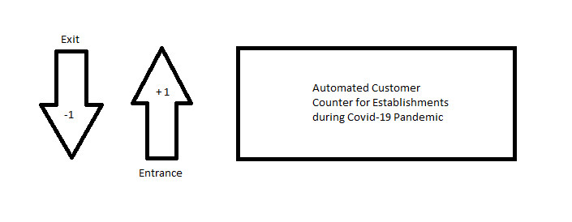

<h1 align="center">Automated Customer Counter - School Project</h1>

 A project I developed to pass one of my college subject. It is an <b>Automated Customer Counter</b> which uses an <b> Ultrasonic Sensor</b> to determine if a customer enters an establishment. It is developed to combat overcrowding and decrease population density during the height of Covid-19 Pandemic.

## 🖼️ Preview

### Concept

 To determine if a customer enters or exits the establishment, it is separated into two lanes. The Ultrasonic Sensor's algorithm will automatically determine whatever lane the customer is currently in by making use of the person's distance. 

### Top View

 The ultrasonic sensor is located in the left side of the image and an I2C LCD Display in the right side. 

### Top View

 An I2C LCD used for displaying the current count of customers inside the establishment.

### 🛠️ Project Components

<ul>
   <li>Arduino Uno.</li>
   <li>Ultrasonic Sensor.</li>
   <li>I2C LCD - To display the number of customers currently inside.</li>
   <li>Red LED - Serves as an indicator which lights up if the establishment is full.</li>
   <li>Green LED - Serves as an indicator which lights up if the establishment is not yet full.</li>
   <li>Buzzer - Serves as an indicator which will buzz if the establishment is full.</li>
   <li>220V - 5V Relay & Light Bulb (Actuator) - If establishment is full, light up Bulb. <i>You can use any actuator as long as the Relay can handle it.</i></li>
</ul>

## ❓ How to use

1. Download and install [Arduino IDE](https://www.arduino.cc/en/software).

2. Carefully configure the wirings and components of the project.

3. Tweak the code depending on your needs, both Pins and the amount of customer you want to trigger the Warning/ Alert events.
    

   ` if (peopleCount <= N && peopleCount >= 0) : Line 87`
    

   ` else if (peopleCount > N) : Line 92`

4. Before uploading the code, make sure that you have selected the correct BOARD and PORT of your Arduino by going to **Tools->Board** and **Tools->Port**.
