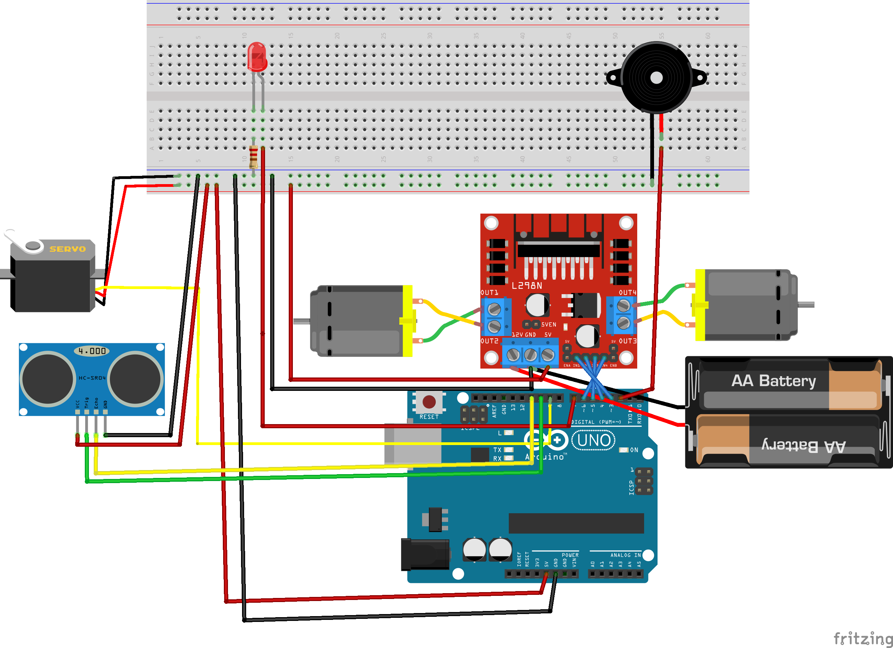

<h1 align="center">Autonomous Two Wheeled Car Robot</h1>

 A hobby project that uses a simple algorithm to create an autonomous car robot that can navigate its way and avoid walls or objects in front of it.

## 🤔 How it works

 If the car detects an object in front of it, it will stop and go backwards. It will then survey the area in front of it, both left and right using an Ultrasonic Sensor attached to a Servo. If one of the two sides doesn't have an object, it will go to that direction and go forward; the cycle repeats again and again.

## 🔗 Wirings

 Make sure that all components are connected properly.

### 🛠️ Project Components

<ul>
   <li>Arduino Uno.</li>
   <li>Ultrasonic Sensor.</li>
   <li>2x 18650 Batteries w/ enough Voltage and Current for both the Driver and Bluetooh.</li>
   <li>2x DC Motors w/ L298n Motor Driver.</li>
   <li>Buzzer, LED, Servo, and Breadboard.</li>
</ul>

## ❓ How to use

1. Download and install [Arduino IDE](https://www.arduino.cc/en/software).

2. Carefully configure the wirings and components of the project.

3. Tweak the code depending on your needs.

4. Before uploading the code, make sure that you have selected the correct BOARD and PORT of your Arduino by going to **Tools->Board** and **Tools->Port**.
