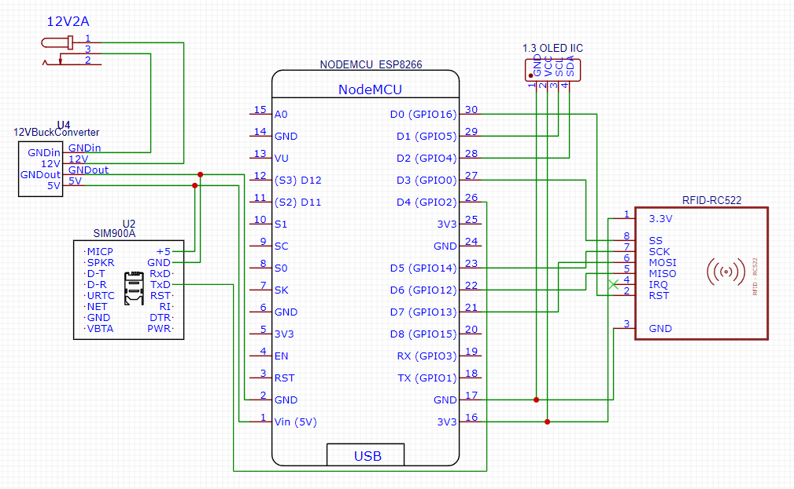
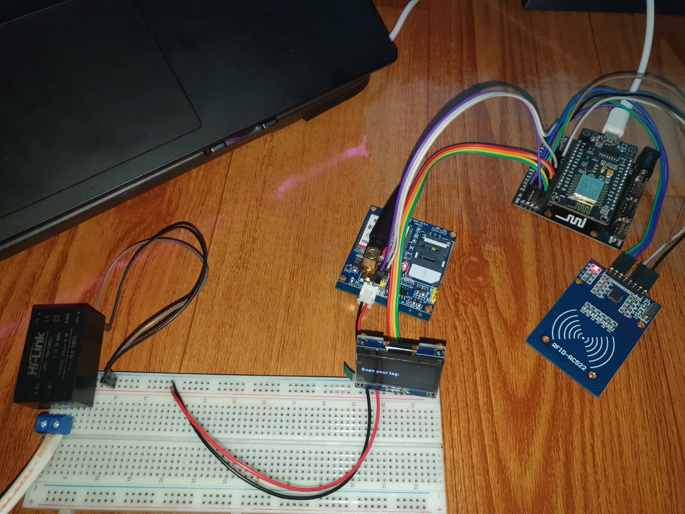
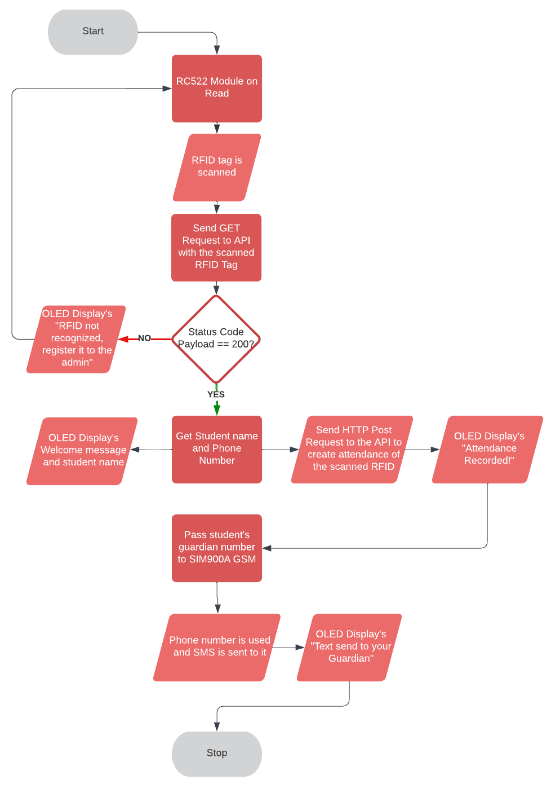

<h1 align="center">IoT-based Attendance System using RFID with SMS Capability</h1>
<p align="justify">
 A protoype of my Undergraduate Thesis where I used an ESP8266 NodeMCU rather than Raspberry Pi. The project is connected in a Node.js-Express.js based REST API which consumes both GET and POST HTTP Methods. The third image below explains the algorithm on how the project works from the scanning of the RFID tag, to creating an Attendance of the RFID owner.
</p>

## 🖼️ Preview

### 🧠 What you'll learn

<ul>
   <li>You'll be able to interface the following: </li>
    <ul>
      <li>RC522 Reader with ESP8266 NodeMCU</li>
      <li>SIM900A GSM Module with ESP8266 NodeMCU</li>
      <li>1.3in OLED with ESP8266 NodeMCU</li>
    </ul>
    <li>Send HTTP Requests to any REST API (GET & POST HTTP Methods)</li>
</ul>

### 🛠️ Project Components

<ul>
   <li>ESP8266 (NodeMCU) - Main brain of the project.</li>
   <li>RC522 RFID Reader - To read RFID tags which will determine who the owner is inside the database.</li>
   <li>1.3inch OLED - To display instructions, and information on what process it is currently undergoing.</li>
   <li>SIM900 A GSM Module - To send an SMS alert to the phone number of the parents after a successful RFID Scan.</li>
   <li>Hi-Link AC-DC Step-down PSU - To supply enough power needed.</li>
   <li>An Online/ Offline REST API - Create one (GET & POST).</li>
</ul>

### Schematic Diagram



<p align="justify">
 Tweak to your needs but make sure that all of them are connected properly as they are sensitive especially the GSM Module which can burn if it is power supplied wrong.
</p>

### Prototyping with Breadboard



<p align="justify">
 A working prototype of the project in its bare parts.
</p>

### Algorithm Flowchart



<p align="justify">
 The process repeats over and over again. The most important part of the project is the communication between the REST API. It must be the top most priority if you want to follow the project.
</p>

## ❓ How to use

1.  Download and install [Arduino IDE](https://www.arduino.cc/en/software).

2.  Create your REST API (POST & GET).

3.  Install all required libraries inside/outside the Arduino IDE.

4.  Carefully configure the wirings and components of the project based on the Schematic Diagram.

5.  Tweak the code especially the Wifi Credentials and REST API Host.
    <br>

    ```
    const char *ssid = "Insert SSID"; : Line 43
    const char *password = "Insert Password"; : Line 44
    ```

      <br>
      
      ```
      const char *host = "http://your-rest-api.com/api"; : Line 48
      http.begin(wifiClient, host + String("/user/") + tag); : Line 120
      http.begin(wifiClient, host + String("/attendance")); :Line 150
      ```

6.  Before uploading the code, make sure that you have selected the correct BOARD and PORT of your NodeMCU by going to **Tools->Board** and **Tools->Port**.
    `
